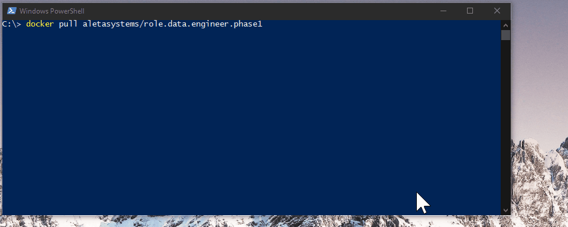

# How To Start Docker Container

This How-To will show you how to start the docker container

1. Download the latest docker image `docker pull aletasystems/role.data.engineer.phase1`
2. Run the container `docker run -e "ACCEPT_EULA=Y" -e "SA_PASSWORD=P@ssw0rd!" -p 14333:1433 --name technicalscreen -d aletasystems/role.data.engineer.phase1`
3. _Wait for 2 minutes._
4. Open Azure Data Studio
5. Open the folder
6. Open the `Technical-Questions\**-AzureDataStudio-SQLNoteBook-*.ipynb` file
7. `Attach`(Connect) to the Local SQL Server Instance `Localhost, 14333` | `sa` | `P@ssw0rd!` (default and based on step 2 values)

## Screencast

> Note: If you have any issues with starting the container please restart docker, Restart your computer.
> Part of this technical evaluation is also to assess your ability to install docker, if you find yourself taking more than 15 minutes to get the set-up done. Please get in contact with us for an alternative solution. 