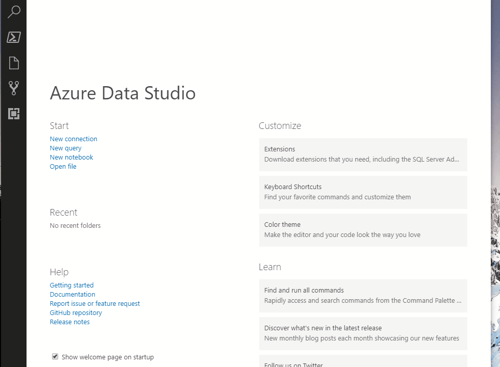

# How To Start/Connect to Azure Data Studio

> If you rather use SSMS, then see SSMS guidelines [02-Use-SSMS-Instead](./02-Use-SSMS-Instead.md)

This How-To will show you how to connect to the Docker container you just created & open the `.ipynb` file.

1. Open Azure Data Studio
2. Open the folder
3. Open the `Technical-Questions\**-AzureDataStudio-SQLNoteBook-*.ipynb` file
4. `Attach`(Connect) to the Local SQL Server Instance `Localhost, 14333` | `sa` | `P@ssw0rd!` (default and based on step 2 values in [00-Start-Docker-Container](./01-Connect-To-AzureDataStudio.md)
5. Trust the notebook
6. Run Cells

## Screencast

## Tips

- Edit a cell by double clicking on it

