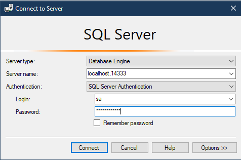

# How To use SSMS instead

This How-To will show you how to connect to the Docker container you just created with **SSMS**

## _default_ Credentials 

- **SQL Server Login**: `sa`
- **SQL Server Password**: `P@ssw0rd!` (or value of `SA_PASSWORD` in step 2 of [00-Start-Docker-Container](./01-Connect-To-AzureDataStudio.md))
- **SQL Server Port**: `14333`

## Viewing the ipynb file.

Github will natively renders `.ipynb` files, for example if you click [here](../Technical-Questions/01-AzureDataStudio-SQLNoteBook-Basic-Query.ipynb) (_and wait_) you will see the rendered notebook.

1. Open the `.ipynb` on github 
2. Write the SQL Query and Save it in the format `<<ipynb-filename>>__<<question_number>>` 
    - For file - eg: `01-AzureDataStudio-SQLNoteBook-Basic-Query.ipynb` there are two questions (_at the time of writing this_) 
    - eg: `01-AzureDataStudio-SQLNoteBook-Basic-Query__01.sql` 
    - eg: `01-AzureDataStudio-SQLNoteBook-Basic-Query__02.sql` 
