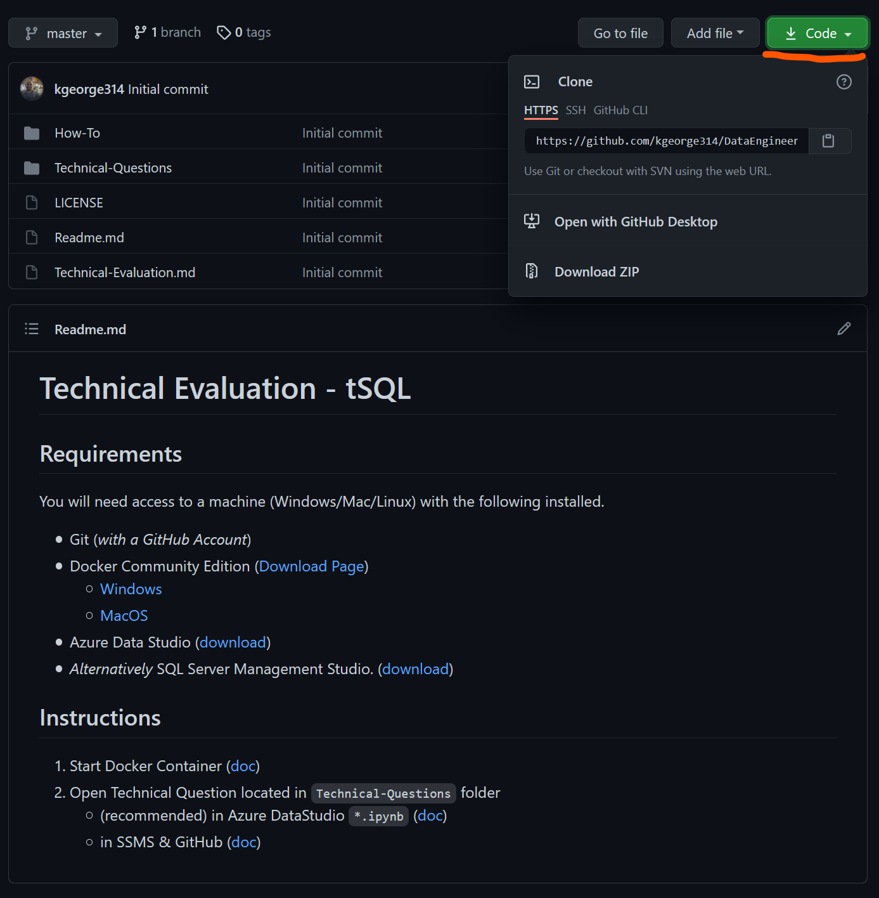

# How To use a 'Template' Repository

> Ensure you are **logged** into Github.

## Instructions

1. Click `Use this template`
    1. 
1. Fill out the requested details
    1. The Repository Name doesn't matter, but we recommend using the format `FirstName-LastName-Role`
    1. **Important**: Please set the repository to `private`
    1. 
1. Clone your repo as you normally would using, `git clone` , GitHub Desktop Client etc.
    1.  
