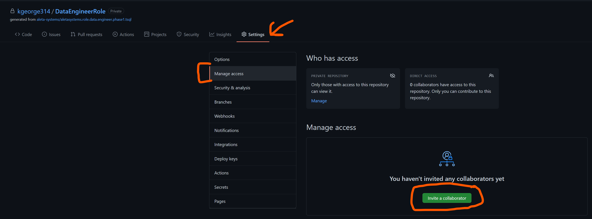
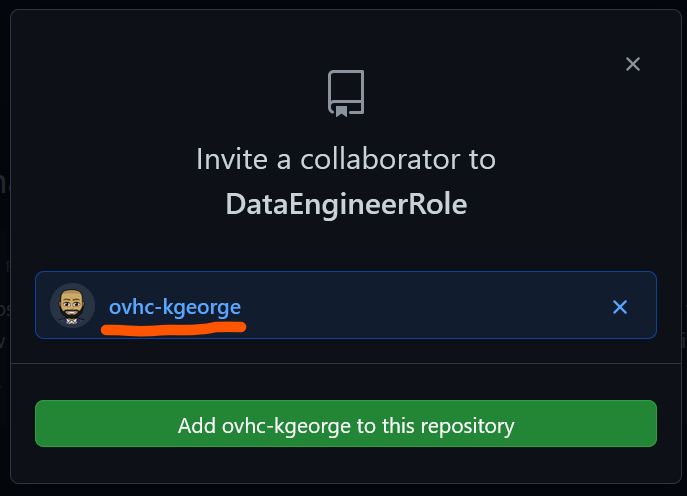

# How To Give Oneview Access

Congratulation! you are done with evaluation. You now need to grant us access to the project so that we can evaluate it

## CheckList

1. Have you reviewed your code and are happy with it?
1. Have you `commited` (`git commit`) the code and published it to GitHub (`git push origin....`)

## Grant Oneview Access

1. In your GitHub Repository that you created in ([How to use a Template Repo](./11-Use-A-Template-Repo.md))
1. Go to the `Settings` Tab
1. Click `Manage Access`
1. Click `Invite Collaborators`
    1. 
1. Add `ovhc-kgeorge`
    1. 
1. Please reply to email saying that you've completed the evaluation.
